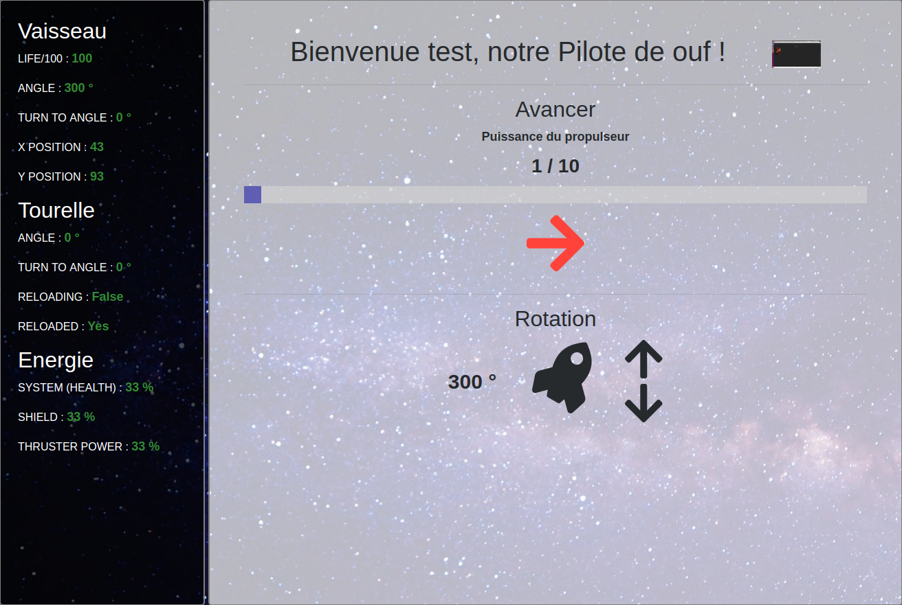

HTML5 Mars Project Contrôleurs
------------------------------

# Auteurs

CULIERAS Julien - BOUDIER Benjamin : Pilote

BENTO-PEREIRA David - BONIN Léo : Tourelle

DAVID Axel - PAUTET Romain : Ingénieur

# Description

## Pilote

Le dashboard du pilote est composé d'une interface d'information sur l'état du vaisseau (partie gauche) et un centre de commande du vaisseau (partie droite).

Vous pouvez augmenter les puissance des propulseurs (afin d'augmenter la vitesse du vaisseau) et vous avez, en tant que pilote, un contrôle sur la rotation et le déplacement du vaisseau.

Si vous préférez utiliser les touches de votre clavier afin de contrôler le vaisseau voici la liste des commandes disponibles :

* → : déplacer le vaisseau
* ↓ : rotation dans le sens horaire
* ↑ : rotation dans le sens anti-horaire
* "+" : Augmenter la puissance des propulseurs
* "-" : Diminuer la puissance des propulseurs

Go to [http://localhost:8080/controller/pilot](http://localhost:8080/controller/pilot)

## Artilleur

Le dashboard de l'artilleur se compose d'une interface d'information sur l'état du vaisseau (partie gauche) réactualisé chaque seconde et d'un centre de commande de la tourelle (partie droite). Ce dernier se compose de trois panneaux :
- Le premier permet de contrôler l'angle de tir de la tourelle
- Le second permet de tirer avec la tourelle selon plusieurs niveau de puissance
- Le troisième panneau est un bonus permettant de contrôler également la partie déplacement

(Bonus) Il est à noter que si vous disposer d'un gamepad, il est possible de le connecter et de contrôler le vaisseau spatial direcetement depuis-celui-ci !

(Bonus) Grâce au clavier ou au gamepad, vous pouvez controler également l'énergie du vaisseau. Cependant aucun panneau de contrôle graphique n'a été développé (sorry not sorry).

Si vous préférez utiliser les touches de votre clavier afin de contrôler le vaisseau voici la liste des commandes disponibles :

* ↓ : rotation de la tourelle dans le sens horaire
* ↑ : rotation de la tourelle dans le sens anti-horaire
* → : déplacer le vaisseau à 0°
* <-- : déplacer le vaisseau à 180°

* "A" : Tirer à 25% de puissance
* "Z" : Tirer à 50% de puissance
* "E" : Tirer à 75% de puissance
* "R" : Tirer à 100% de puissance

* "Q" : Orienter le vaisseau dans le sens anti-horaire
* "S" : Déplacer le vaisseau
* "D" : Orienter le vaisseau dans le sens horaire

* "W" : Contentrer toute l'énergie dans la vitesse de déplacement du vaisseau
* "X" : Contentrer toute l'énergie du vaisseau dans le bouclier
* "C" : Contentrer toute l'énergie du vaisseau dans l'énergie du système

Go to [http://localhost:8080/controller/turret](http://localhost:8080/controller/turret)

## Ingénieur

Le widget de la gestion de l'énergie permet de régler les proportions d'énergies allouées aux unités de "propulsion", "bouclier" et "système".
Des curseurs permettent de changer la part de chaque unité (les autres sont calculées en conséquence). Des bouttons d'incrémentation et de décrémentation permettent une approche pas à pas.
Des combinaisons de touches facilitent ces changements : **a** modifiera la propulsion, **z** le bouclier, **e** le système, grâce aux modificateurs **←** et **→** permettant respectivement la décrémentation et l'incrémentation de l'unité.

Des paramètres peuvent altérer le fonctionnement général du widget :

* mode automatique : délègue la gestion à une pseudo-intelligence basique
* modificateur de pas : change le pas de modification

Un 3ème élément informe du niveau de vie du vaisseau.

Go to [http://localhost:8080/controller/engineer](http://localhost:8080/controller/engineer)
